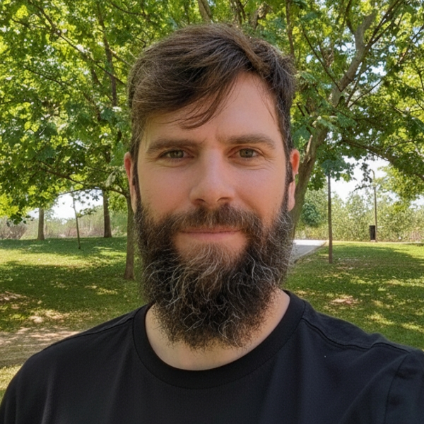

import { SITE_TITLE, SITE_DESCRIPTION } from '../consts';

{/*
  Note: The 'title' and 'description' in the YAML frontmatter above are static strings
  that are passed to your layout for the <head> tag.

  The import statement above makes the SITE_TITLE and SITE_DESCRIPTION
  constants available for use here in the main body of the page.
  For example, you could write: Welcome to {SITE_TITLE}.
*/}

## Agility, Innovation, and Leadership

I’m a Software Engineer focused on helping people improve their skills and achieve their goals. 

After **more than 15 years dedicated to software projects**, leading work teams, and helping organizations to develop successful products, I have discovered that non-technical areas are as much as important and relevant as technical areas.

I speak from my own experience as an employee, as a teammate, as an entrepreneur… as a person. I read, experiment, learn, rehearse, make mistakes, retest, fail early, analyze, and **start again!** Little by little, I am developing a method that I share through keynotes, courses, and my blog.

## Sessions

Find here some recorded sessions example from different congress I have participated:

- DrupalCon Europe 2024 - Barcelona, Spain: Exploring Agile Contracts: Maximizing Collaboration and Value in Client Relationships
- DrupalCon Europe 2023 - Lille, France: [Strategies for Overcoming Common Software Development Challenges - A Management Perspective](https://www.youtube.com/watch?v=6gMDCBqNSEk)
- DrupalCamp 2023, Sevilla, Spain: [Managing Complexity: Best Practices for Software Development Project Managers](https://www.youtube.com/watch?v=eWWVIsDYpTw)
- DrupalCon Europe 2020 - Barcelona, Spain: [Self-Management in remote environments](https://www.youtube.com/watch?v=0zax_kubN10)
- DrupalDevDays 2019 - Transylvania, Romania: [Diving into Peopleware](https://www.youtube.com/watch?v=ze6zgpKOugQ)
- DrupalCamp  2017 - Madrid, Spain:  [BDD: Behaviour Driven Development](https://www.youtube.com/watch?v=01mK_1Fn9Ts)

## Professional Projects

### Metadrop

I am co-owner of [Metadrop](https://metadrop.net). Metadrop is positioned among the 25 most relevant Drupal companies in the World (over +2,300 companies) and among the 10 most relevant in Spain.

- +100 Contributed Official Modules at Drupal.org
- +250 Contributions to Drupal.org projects.
- Development teams with members with 10+ years of experience in Drupal, more than 5 years of experience on average.

You have a project in mind: [contact us](https://metadrop.net/en/contact)

### GruposMadrid

Founder of [GruposMadrid.com](https://gruposmadrid.com/) (2004 - 2023), a music bands plaform site create to boost music and artists in Madrid, Spain. With this site we were able to support more that 100.000 bands, artist and bands. Festivals, Albums and lots of joy. Thank you all for being part of this movement.

## Personal Projects

### Today ends Dying

Founder and Guitarist in the Band [Today ends Dying](http://todayendsdying.com) (2004 - 2009) borns without any musical label, with the only purpose to find their own creative space within the musical scene. The band began in the summer of 2004. In the Summer of 2005 the band begins to record their first Demo "Sometimes it seems to be yours", three years after in 2008 released their first album "Let the pieces fit". If you like metal and post-rock, give a try, you can download the album for free in the official site. 
